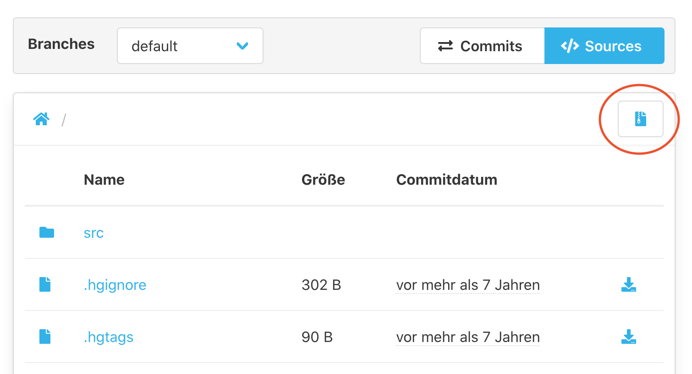

Um ein Zip Archiv aus einem Repository herunterzuladen, 
kann man in der oberen rechten Ecke der Sources Ansicht eines Repositories auf den Archiv Button klicken (siehe Screenshot).

 

Das Plugin wird dann ein Zip Archiv der ausgewählten Revision und des aktuellen Ordners erstellen und herunterladen.

