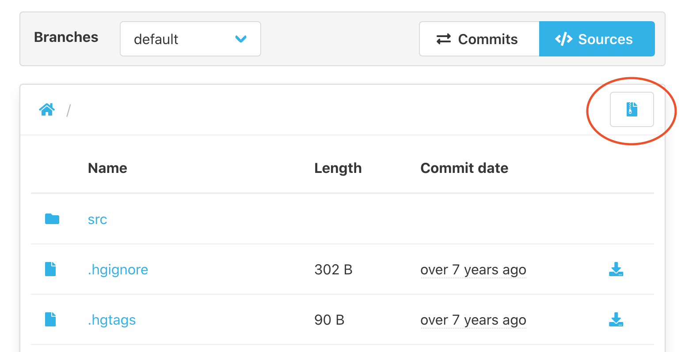

To download an archive from a repository, 
visit the source browser of the repository and hit the archive button in the upper right corner (see screenshot).

The plugin will create a zip archive of the selected revision and directory.

 
